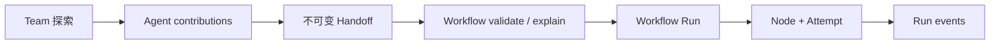
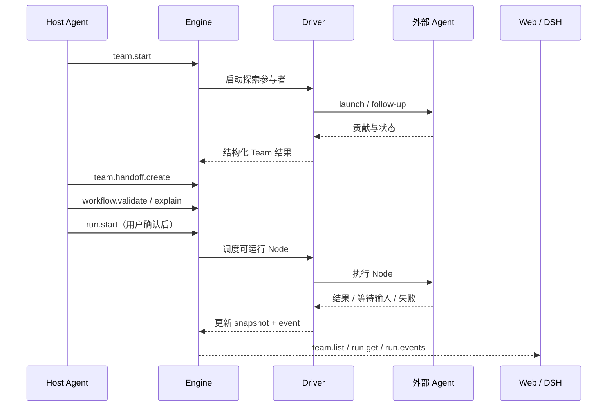

# Fishyume 总体架构与开发指南

状态：当前开发基线（2026-08-28）

这份文档是 Fishyume 的工程入口。它回答三个问题：系统由哪些层组成、一次任务如何流转、下一步按什么顺序开发和验证。

## 一句话定位

Fishyume 是一个本地 AI Agent 协作控制平面：它不替代 Codex、Claude Code 或 OpenCode，也不直接负责模型调用；它负责把多 Agent 探索、人工确认和 Workflow 执行组织成可观察、可恢复、可审计的过程。

## 总体架构

```mermaid
flowchart TB
    User[用户]
    Host[Host Agent\n理解意图 / 创建 Team / 确认 Handoff]
    Engine[Fishyume Engine\n唯一状态真源]
    Team[Team Service\n参与者 / 消息 / Handoff]
    Workflow[Workflow Service\n解析 / 校验 / 解释]
    Run[Run Scheduler\nDAG / Node / Attempt / 恢复]
    Routing[Routing + Driver\nCodex / Claude / OpenCode]
    Store[Persistence\nSnapshot / Event / Lease]
    Agent[外部 Agent CLI 或 App Server]
    Web[Standalone Web\n独立诊断与操作入口]
    DSH[DSH Native Plugin\nSidebar footer + shell overlay]

    User --> Host
    Host -->|MCP / CLI / DSH RPC| Engine
    Engine --> Team
    Engine --> Workflow
    Engine --> Run
    Run --> Routing
    Routing --> Agent
    Engine --> Store
    Web -->|HTTP JSON-RPC gateway| Engine
    DSH -->|Typert Remote\nHTTP gateway (compatibility fallback)| Engine
```

核心规则是：Engine 保存业务状态，Host Agent 发起业务意图，Web 和 DSH 只做状态投影与有限操作。UI 不得直接读取 `wf-engine/internal/*`，也不得自己推导 Run 的最终状态。

## 分层与代码位置

| 层 | 代码位置 | 职责 | 不负责什么 |
|---|---|---|---|
| Engine 核心 | `wf-engine/internal/*` | Team、Workflow、Run、调度、恢复、持久化、事件 | 不依赖 React、Ink、DSH UI |
| 公共合同 | `wf/src/bridge/*`、`contracts/*` | 方法名、参数、响应类型、版本兼容 | 不实现调度逻辑 |
| Host Agent 接入 | `wf` CLI / MCP | 将自然语言意图转为 Team、Handoff、Workflow 和 Run 操作 | 不拥有第二份状态 |
| Driver / Routing | `wf-engine/internal/driver/*`、`internal/routing/*` | 发现 Agent、选择 Route、启动和回收外部进程 | 不把 Provider 密钥写入 Fishyume 状态 |
| DSH host 面 | `fishyume-web/src/plugin.ts` | 注册 DSH webServer 路由、EngineBridge、token、focus | 不渲染 React 工作区 |
| DSH client 面 | `fishyume-web/src/client/plugin.tsx` | 注册官方 Slot、渲染原生 React 工作区、调用 transport | 不创建 iframe，不启动独立 Engine |
| 独立 Web 面 | `fishyume-web/src/client/main.ts` | 在没有 DSH 时提供完整浏览器控制台 | 不绕过 gateway 直接访问 Engine |

可以把它理解为：Engine 是“账本和调度中心”，Host 是“决策者”，Driver 是“执行适配器”，Web/DSH 是“仪表盘和操作台”。

## 核心业务模型



- **Team**：前期探索。多个 Agent 独立贡献方案、证据和意见。
- **Handoff**：探索结果的不可变交接记录。它保存决策和验收期望，不会自动偷偷启动 Workflow。
- **Workflow**：经过 Host Agent 和用户确认的正式执行计划，通常是有依赖关系的 DAG（有向无环图）。
- **Run**：某个 Workflow 的一次执行实例，包含 Node、Attempt、状态版本、事件和恢复信息。
- **Driver**：把一个 Node 映射到具体的 Codex、Claude Code 或 OpenCode 会话，并把外部结果归一化回 Engine。

典型链路如下：



## 当前实现状态

| 区域 | 状态 | 说明 |
|---|---|---|
| Core Engine | 基本完成 | Team、Workflow、Run、Driver、Routing、持久化、恢复和 MCP/CLI 基线已存在 |
| Standalone Web | 基线完成 | loopback sidecar、Bearer token、gateway、Team/Handoff/Run/Routing 和 focus 已实现 |
| Native DSH UI | 迁移中 | 已去掉 iframe 方向，使用 `sidebar.footer.action` + `shell.overlay` 原生入口 |
| 正式 DSH Remote | 已接入代码 | host 注册 Typert manifest，client 通过 `ctx.remote.$mount()` 调用；HTTP gateway 仍保留作 standalone 和排错 fallback |
| UI 领域层拆分 | 未完成 | 原生 client 目前集中在 `client/plugin.tsx`，尚需抽出 store、views 和 action 层 |
| Run 操作闭环 | 基础完成 | Native Run 面板已支持 cancel、approve、reject、retry；后续按真实使用反馈补细节 |
| 真实 DSH 验收 | 未完成 | 还需要安装到 web profile，启动真实 DSH 并做浏览器加载、截图和交互验证 |

“基本完成”不等于已经发布稳定版；真实 Provider smoke 和真实 DSH 加载仍是显式验收项。

## DSH 插件形态决策

DSH 当前公开、可验证的第三方组合点是：

1. `sidebar.footer.action`：提供一个稳定的 Fishyume 入口。
2. `shell.overlay`：打开 DSH shell 内的原生 React 工作区。

当前不采用悬浮窗或 iframe SPA，也不假设存在公开的 `shell.sidebar`、`shell.details` 槽位。插件必须遵守 DSH 的生命周期：注册、监听、定时器和资源都通过 effect 管理，并在卸载时清理。

两种运行形态必须分开理解：

```text
Standalone Web: Node sidecar + 独立 document + /api/rpc
Native DSH:     DSH host + 原生 Slot + Typert Remote
                                  \ HTTP gateway（兼容 fallback）
```

它们共享 Engine 合同和 gateway 语义，但不共享 document shell，也不应该互相启动对方的服务。

## 开发方案与顺序

### 步骤 0：确定当前工作基线

- 保留当前未提交改动，先确认项目能构建、测试能运行。
- 将公共 API 暂时以 `wf/src/bridge` 和 `contracts` 为参考，避免 UI 随意发明一套不同的响应字段。
- 接口不是永久冻结的；发现实际需求不匹配时，直接修改合同、实现和测试。

### 步骤 1：先让 Engine 主链路稳定可用

- 确认 Team → Handoff → Workflow → Run 的状态转换和幂等键。
- 确认 `run.get`、`run.events`、`run.action` 的版本检查、取消、重试和审批语义。
- 对真正容易出错的动作补少量 Engine 单测和恢复测试，不追求一开始覆盖所有边界。

验证目标：Engine 重启后还能恢复 Run；失败和等待输入不会被 UI 显示成成功；重复操作不会造成明显副作用。

### 步骤 2：用 Standalone Web 快速验证

- 保持 Bearer token、loopback、CSP 和静态资源安全策略。
- 让独立 Web 使用公共 bridge/types 和统一 transport。
- 用真实 Engine 手动验证 Team、Handoff、Run、Routing 的读取和事件刷新。

验证目标：没有 DSH 时，开发者仍能独立启动 Web，快速判断问题在 Engine、gateway 还是 UI。

### 步骤 3：接通 Native DSH 插件最小闭环

- host 面注册 `/plugins/dsh-fishyume/token`、`/api/rpc`、`focus` 和静态资源路由。
- client 面只注册 `sidebar.footer.action` 与 `shell.overlay`。
- 首屏只做 Team、Handoff、Run、Routing 观察和 focus 联动。
- 先使用 Typert Remote，Remote 不可用时回退到 HTTP gateway；这样 standalone 和旧 DSH profile 仍能工作。

验证目标：插件加载不影响 DSH 对话；面板不是 iframe；窄屏可用；打开插件时不会无条件启动 Engine。

### 步骤 4：哪里痛再拆哪里

建议把当前 `client/plugin.tsx` 拆为：

```text
fishyume-web/src/client/
  transport.ts             # RPC/HTTP 传输
  store.ts                 # 外部可订阅状态与 focus
  views/TeamWorkspace.tsx  # Team/Handoff
  views/RunWorkspace.tsx   # Run/Node/Event
  views/RoutingWorkspace.tsx
  plugin.tsx               # DSH Slot 装配，仅保留入口
```

只有当 `client/plugin.tsx` 真的影响修改效率时，再拆出 store 和 views；不要为了目录看起来完整而提前抽象。之后再增加 `run.action` 的 cancel、retry、approve，以及 Handoff 到关联 Run 的跳转。

### 步骤 5：真实 DSH 手动试用

- 安装到真实 `web` profile，重启 DSH，确认插件能加载。
- 用浏览器试用 sidebar 入口、overlay 开关、focus、刷新和错误态。
- 遇到问题时记录截图、控制台错误、network 请求和 Engine 日志。
- HTTP fallback 是否保留，以实际调试便利性决定，不预设必须删除。

## 测试分层

| 测试层 | 目标 | 当前工具/位置 |
|---|---|---|
| Engine 单测 | 状态机、调度、恢复、幂等 | `wf-engine/internal/**/*_test.go` |
| 合同测试 | bridge 与 gateway 的方法/字段一致 | `wf`、`contracts`、`fishyume-web/src/*test.ts` |
| 插件装配测试 | Slot、route、生命周期和无 iframe | `fishyume-web/src/client-plugin.test.ts`、`plugin.test.ts` |
| Transport 测试 | token 缓存、RPC 优先、HTTP fallback | `fishyume-web/src/client-transport.test.ts` |
| 基本检查 | 类型、测试、bundle、差异空白 | `npm run typecheck`、`npm test`、`npm run build`、`git diff --check` |
| 手动试用 | DSH 加载和浏览器交互 | 尚未完成，需真实 web profile |

## 推荐阅读顺序

1. 本文，建立全局地图。
2. [`fishyume-product-scope.md`](fishyume-product-scope.md)，确认产品边界和明确不做的事情。
3. [`fishyume-m4-agent-native-control-plane.md`](fishyume-m4-agent-native-control-plane.md)，理解 Host、Driver、Control Plane 和 MCP。
4. [`fishyume-m6-core-contract-freeze.md`](fishyume-m6-core-contract-freeze.md)，确认公共合同和兼容策略。
5. [`fishyume-m7.5-implementation-plan.md`](fishyume-m7.5-implementation-plan.md) 与 [`fishyume-m7.6-host-web-continuity.md`](fishyume-m7.6-host-web-continuity.md)，理解 Web sidecar 和 focus。
6. [`fishyume-dsh-native-plugin-ui-plan.md`](fishyume-dsh-native-plugin-ui-plan.md)，理解 DSH 原生 UI 决策。
7. 代码入口：`wf-engine/internal/controlplane` → `wf/src/bridge` → `fishyume-web/src/plugin.ts` → `fishyume-web/src/client/plugin.tsx`。

## 当前开发者的下一步

下一次编码按这个顺序执行：

1. 先启动 standalone Web，确认 Engine 和 gateway 能工作。
2. 在真实 DSH 中加载当前原生插件，确认 Typert Remote 能调用；异常时仍可通过 HTTP gateway 定位问题。
3. 根据实际痛点决定是否抽离 native client 的 store 和 views。
4. 让用户重启 DSH，手动确认 native Remote、Run 操作和 focus 是否生效。
5. 依据截图和日志修复真实问题，再决定是否补充更多 Run 细节。

这五步完成后，Fishyume 才从“有插件代码”进入“可在 DSH 中稳定使用的插件”。
