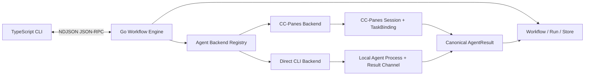

# Fishyume M2.1.2 后端独立性架构

> 状态：已确认
> 日期：2026-08-05
> 前置里程碑：M2.1.1（首个可安装 Alpha）已完成

## 1. 决策摘要

Fishyume 的产品定位调整为：

> Fishyume 是一个本地优先、平台无关、可恢复的 AI Agent 工作流编排引擎。它负责 Agent 工作流的调度、状态、上下文、人工审批、恢复与取消；具体 Agent 的启动、观察和终止由可替换的执行后端负责。

CC-Panes 是 Fishyume 的首个正式执行后端，但不是产品或核心架构的边界。M2.1.2 暂停 M2.2 并发工作，优先纠正当前实现中的 CC-Panes 耦合，并用第二个真实执行后端证明抽象成立。

M2.1.2 不把 Fishyume 扩张为通用工作流平台。Fishyume 继续专注 Agent 与人工决策，不在本里程碑支持任意 Shell、HTTP、容器、数据库、定时器或消息队列节点。

## 2. 背景与问题

M1 架构基线已经要求“把 CC-Panes 作为第一个 Backend，而不是产品本身的架构边界”，并规定 CC-Panes 的 launch ID、session ID、TaskBinding ID 只能存在于 Backend 私有 metadata 中。

M2.1.1 实现了可靠的 CC-Panes 垂直链路，但当前代码仍有以下边界泄漏：

- Engine 入口直接构造 `ccpanes.New()`，没有 Backend 注册与选择机制。
- RPC `supportedBackends` 固定返回 `ccpanes`。
- 通用 Doctor 报告直接生成 CC-Panes orchestrator、daemon 和项目注册提示。
- `AttemptSnapshot` 暴露 `TaskBindingID`。
- 运行服务中的部分错误与等待消息把 TaskBinding 当成通用完成协议。
- TypeScript 集成测试通过 fake `cc-panes-ctl` 验证完整链路，但没有独立的 Backend 契约测试。

因此，现有 `Backend` 接口只能证明核心代码可以注入测试替身，不能证明 Fishyume 能在不修改调度与状态逻辑的前提下接入第二个真实平台。

## 3. 产品边界

### 3.1 Fishyume 负责

- Workflow 解析、规范化与 DAG 校验。
- Agent 与 Approval 节点的确定性调度。
- Run、Node、Attempt 的生命周期、结论和原因。
- Workflow 级恢复、控制租约、取消意图和 crash reconcile。
- 受限模板、显式上下文引用与规范化 Agent 结果校验。
- 执行后端选择、能力检查和平台无关诊断。
- 把平台观察映射为稳定的 Agent 工作流语义。

### 3.2 执行后端负责

- 检查自身是否可用以及目标工作区是否可执行。
- 按 `AgentExecutionSpec` 启动一个 Agent Attempt。
- 返回可持久化、可恢复的 opaque `ExecutionHandle`。
- 观察已存在的执行，不因 Engine 重启而重复启动 Agent。
- 获取有限诊断输出。
- 请求取消并明确报告是否已确认停止。
- 把平台专属完成证据转换为 Fishyume 的规范化 `AgentResult`。

### 3.3 明确不负责

- 通用 ETL、CI/CD 或业务流程自动化平台。
- 任意脚本、HTTP、容器、数据库或定时任务节点。
- 动态加载第三方二进制插件或稳定的外部插件 ABI。
- M2.2 的 `maxConcurrency > 1`、并发取消和资源配额。
- 自动重试、模型 fallback、远程服务、daemon 或 GUI。
- 在单个 Workflow 中混用多个 Agent Backend；节点级 Backend 选择后置。

未来可以增加服务于 Agent 工作流的受限检查节点，但是否增加必须以“是否提升 Agent 协作的可靠性”为判断标准，不能借此演化为任意任务编排器。

## 4. 目标架构



核心包不得导入具体 Backend 包。具体 Backend 只在组合根注册，并通过统一契约向 Engine 提供能力。

### 4.1 分层

```text
workflow/   Workflow Schema、DAG、条件和模板
run/        Run/Node/Attempt 状态机与调度
store/      持久化、事件和控制租约
backend/    平台无关 Agent 执行契约与注册表
backend/ccpanes/
backend/directcli/
rpc/        对外协议，不硬编码 Backend 名称或诊断
cmd/        组合根，注册可用 Backend
```

### 4.2 Backend、Tool 与 Runtime

三个维度必须分离：

- `Backend`：Fishyume 如何启动、观察、恢复和取消 Agent，例如 `ccpanes`、`direct`。
- `Tool`：实际 Agent 实现，例如 `codex`、`claude`。
- `Runtime`：Agent 所在执行环境，例如 `local`、`wsl`、`ssh`。

例如 `direct + codex + local` 与 `ccpanes + codex + wsl` 使用同一套 Workflow、Attempt 和结果语义。Backend 通过 `Capabilities` 声明自己支持的 Tool、Runtime 和可选诊断能力；Engine 在创建 Run 前完成组合校验。

不得为每个组合创建 `direct-codex`、`ccpanes-codex` 等专属 Backend，也不得在调度器中按组合名称分支。

## 5. 平台无关执行契约

下列类型表达语义方向，具体 Go 命名可在实现计划中微调，但不得重新引入平台专属字段。

```go
type AgentExecutionSpec struct {
    RunID          string
    NodeID         string
    Attempt        int
    Workspace      string
    Tool           string
    Runtime        string
    Instructions   string
    RequiredSkills []string
    ResultContract ResultContract
}

type ExecutionHandle struct {
    Backend       string
    SchemaVersion int
    ID            string
    Data          json.RawMessage
}

type ObservationState string

const (
    ObservationActive       ObservationState = "active"
    ObservationWaitingInput ObservationState = "waiting_input"
    ObservationResultPending ObservationState = "result_pending"
    ObservationTerminal     ObservationState = "terminal"
    ObservationLost         ObservationState = "lost"
)

type ExecutionObservation struct {
    State      ObservationState
    Result     *AgentResult
    Diagnostic string
}

type CancelState string

const (
    CancelConfirmed    CancelState = "confirmed"
    CancelNotConfirmed CancelState = "not_confirmed"
)

type CancelResult struct {
    State      CancelState
    Diagnostic string
}

type AgentBackend interface {
    Name() string
    Capabilities() Capabilities
    Doctor(context.Context, DoctorRequest) DoctorReport
    Start(context.Context, AgentExecutionSpec) (*ExecutionHandle, error)
    Observe(context.Context, ExecutionHandle) (*ExecutionObservation, error)
    Output(context.Context, ExecutionHandle, int) (string, error)
    Cancel(context.Context, ExecutionHandle) (*CancelResult, error)
}
```

### 5.1 契约原则

- `Start` 只用于创建新 Attempt；恢复和状态查询只能调用 `Observe`。
- `Observe` 是所有正式 Backend 的必需能力，不再把 reconcile 设计为可选接口。
- Engine 拥有轮询、有界对账、等待原因和最终 Run 结论；Backend 不直接修改 Workflow 状态。
- `error` 表示调用、传输、权限或协议错误；平台明确但未确认取消必须返回 `CancelNotConfirmed`，不能混用普通错误表达业务状态。
- `ExecutionHandle.Data` 由对应 Backend 私有解析。核心只执行大小限制、UTF-8/JSON 校验和持久化，不读取其中字段。
- Backend 的平台状态不得直接成为持久化的 Run/Node 状态。
- `Output` 只用于有限诊断，不是成功证据，也不自动传入下游节点。

## 6. 规范化 Agent 结果

Fishyume 拥有唯一的跨平台结果模型：

```json
{
  "status": "succeeded",
  "summary": "完成指定任务并通过相关检查",
  "artifacts": ["path/to/file"],
  "warnings": [],
  "checks": ["go test ./..."],
  "usage": {
    "inputTokensEstimated": 0,
    "outputTokensEstimated": 0
  }
}
```

- `status` 只允许 `succeeded`、`failed` 或 `indeterminate`。
- `summary`、集合字段、UTF-8 和总体大小由核心统一校验。
- 结果缺失或格式非法由核心映射为 `waiting: invalid_result`，不得由每个 Backend 自行发明不同语义。
- CC-Panes Backend 从 TaskBinding 转换该结果。
- Direct CLI Backend 从 Fishyume 控制的结构化结果通道转换该结果。
- 进程退出码、终端 Idle、自然语言末尾文本都不能单独作为成功证据。

## 7. Backend 注册与选择

Engine 组合根创建 Backend Registry，而不是直接构造单个 CC-Panes Backend：

```go
registry.Register("ccpanes", ccpanes.NewFactory(...))
registry.Register("direct", directcli.NewFactory(...))
```

Backend 初始化相互隔离。缺少 Codex CLI 只能让 `direct` Doctor 不可用，不能阻止 `ccpanes` 启动；缺少 CC-Panes 也不能阻止用户选择可用的 `direct` Backend。

M2.1.2 只支持 Run 级 Backend，Workflow 内所有 Agent 节点使用同一个 Backend。选择优先级建议为：

1. CLI `--backend <name>`；
2. Workflow `defaults.backend`；
3. `FISHYUME_BACKEND`；
4. 兼容默认值 `ccpanes`。

最终选择必须持久化到 Run。`resume`、`cancel` 和状态对账必须使用创建 Run 时的 Backend，不能被后来变化的默认配置替换。

RPC `engine.hello` 的 `supportedBackends` 从 Registry 动态生成。Doctor 接收 Backend 名称并返回通用结构化报告；人类可读的 CC-Panes Profile、orchestrator、daemon 或项目注册提示由 CC-Panes Backend 提供。

## 8. CC-Panes Backend 迁移

M2.1.2 保留现有可靠行为：

- 专用非交互式 Profile。
- TaskBinding 作为 CC-Panes 平台内的正式完成证据。
- session 与 TaskBinding 对账。
- idle 后有界等待结果。
- WaitingInput、lost/exited 和取消确认映射。

但这些概念只存在于 `backend/ccpanes`：

- `TaskBindingID` 从通用 `AttemptSnapshot` 删除。
- session ID、binding ID、launch ID 和 Profile 信息放入 `ExecutionHandle.Data`。
- CC-Panes Backend 将 TaskBinding 转换为 `AgentResult`。
- 核心错误、Reason 和事件消息不再出现 TaskBinding、orchestrator 或 daemon。

CC-Panes 仍是默认 Backend，保证 M2.1.1 用户体验不因架构纠偏而退化。

## 9. Direct CLI Backend

第二个 Backend 选择 Direct CLI，而不是只增加测试用 fake Backend。首个实现目标为本地非交互式 Codex CLI，后续可扩展 Claude Code，但 M2.1.2 不要求同时支持两者。

Direct CLI Backend 负责：

- 发现并校验受支持的 Agent CLI。
- 在指定 workspace 启动独立进程并持久化可恢复标识。
- 保留 PID、进程启动指纹、结果通道位置等私有 handle 数据。
- 跨 Engine 进程观察 Agent 是否仍存活、等待结果、已经结束或无法确认。
- 在 Windows 和 Linux 上终止对应进程树，并明确返回是否确认停止。
- 通过 Fishyume 控制的结构化结果通道获取 `AgentResult`。

### 9.1 完成通道

实现阶段必须先确认目标 CLI 是否提供稳定、可版本化的机器可读完成事件。只有满足结果字段、大小限制和错误语义时才能直接采用。

如果 CLI 原生事件不足，Direct CLI Backend 使用 Attempt 专属结果文件或本地回调命令。该通道必须满足：

- 路径位于 Fishyume 状态目录，不写入目标项目。
- 每个 Attempt 使用不可预测的本地凭据或等价防串写机制。
- 原子写入并带 Run、Node、Attempt 身份。
- 重复提交幂等，冲突结果拒绝覆盖。
- 完整 prompt、环境变量和凭据不进入结果文件。

不得把“进程退出码为 0”或最后一段自然语言输出等同于成功。

### 9.2 恢复限制

仅保存 PID 不足以安全恢复，因为 PID 可能被复用。handle 至少需要可验证的进程启动指纹；无法确认原进程身份时返回 `ObservationLost`，不得连接或终止不相关进程。

## 10. 持久化兼容

- 新 Attempt 使用通用 `ExecutionHandle`，不再写顶层 `taskBindingId`。
- Handle 必须记录 Backend 名称与自己的 schema version。
- 核心限制 opaque data 大小并禁止保存凭据、完整环境映射和终端历史。
- M2.1.1 Run 必须继续支持 `status`。
- 现有 CC-Panes Run 的 `resume` 和 `cancel` 通过兼容解码器恢复旧 session metadata 与 TaskBinding 信息。
- 不自动删除或批量重写旧状态目录。
- 如果实现验证表明需要升级 `stateSchemaVersion`，必须在实施计划中单独设计兼容读写；不能仅为字段重命名草率升级。

## 11. Backend 契约测试

所有正式 Backend 共享同一组测试场景，平台 fixture 只负责提供操作实现：

1. Doctor 成功、缺少依赖和 workspace 不可用。
2. Start 返回可序列化并可重新加载的 handle。
3. Observe active，不重复启动 Agent。
4. waiting input 映射。
5. result pending 后获得 terminal result。
6. terminal succeeded、failed 和 indeterminate。
7. 结果缺失、格式非法和超限。
8. Engine 重启后使用 handle 对账。
9. cancel confirmed。
10. cancel not confirmed，不制造 cancelled。
11. lost handle 不误杀其他执行。
12. Output 只返回有界诊断。

fake Backend 继续用于调度器单元测试；CC-Panes fixture 和 Direct CLI fixture 分别证明适配器符合相同契约。

## 12. 实施顺序

### 阶段 A：冻结行为并建立契约测试

- 固化 M2.1.1 CC-Panes 成功、等待、恢复、取消和 crash reconcile 行为。
- 建立平台无关 Backend contract test harness。
- 在重构前让现有 CC-Panes Backend 通过该测试集。

### 阶段 B：抽离核心耦合

- 引入 `AgentExecutionSpec`、`ExecutionHandle`、`ExecutionObservation` 和 `CancelResult`。
- 用必需的 `Observe` 统一 Wait/Reconcile 语义。
- 移除核心 TaskBinding 字段和 CC-Panes 诊断文本。
- 保持现有 Run 行为和外部 CLI 默认值不变。

### 阶段 C：Registry 与显式选择

- 增加 Backend Registry 与 Factory。
- RPC 动态暴露 Backend。
- CLI、Workflow defaults 和环境变量支持 Run 级 Backend 选择。
- 确保 resume/cancel 固定使用持久化 Backend。

### 阶段 D：Direct CLI Backend

- 先完成 CLI 能力与完成通道 spike。
- 实现本地进程生命周期、结构化结果、恢复和取消。
- 支持同一 Agent → Approval → Agent smoke Workflow。

### 阶段 E：产品与发布验证

- 更新 README 与 Doctor，区分默认 CC-Panes 和 Direct CLI 环境要求。
- 完成 Windows 与 Linux 自动测试。
- 分别执行 CC-Panes 与 Direct CLI live smoke。
- M2.1.2 收口后再讨论 M2.2 并发。

## 13. 验收标准

M2.1.2 必须同时满足：

1. `workflow`、`run`、`store` 和 `rpc` 核心代码不导入 `backend/ccpanes` 或 `backend/directcli`。
2. 通用 snapshot、Reason、RPC 类型和 Engine 诊断不包含 TaskBinding、CC-Panes Profile、orchestrator 或 daemon 字段。
3. `supportedBackends` 来自 Registry，不再硬编码。
4. 新 Run 可通过显式配置选择 `ccpanes` 或 `direct`，并把选择持久化。
5. 同一 YAML Workflow 在两个 Backend 上完成 Agent → Approval → Agent。
6. 两个 Backend 都通过统一 contract test suite。
7. Engine 在 Agent 运行期间退出后，`resume` 不重复启动 Attempt。
8. Direct CLI PID 被复用或身份无法确认时，不观察或终止无关进程。
9. 两个 Backend 的 cancel 都只有在明确确认停止后才写 `cancelled`。
10. 平台完成证据都转换为相同 `AgentResult`，下游模板不感知来源平台。
11. M2.1.1 历史 Run 可读取；现有 CC-Panes 恢复与取消行为不回退。
12. Go test/vet/build、Linux race、TypeScript typecheck/test/build、平台安装与打包检查全部通过。
13. 两次 live smoke 后不存在遗留 Engine、Agent CLI 或测试进程。

只完成接口重命名、只增加 fake Backend，或仍需在调度器中按 Backend 名称编写条件分支，均不算通过 M2.1.2。

## 14. 风险与控制

### 14.1 抽象过度

风险：在只有两个 Backend 前设计插件系统、远程协议或大量可选能力。

控制：M2.1.2 只支持编译期注册、Run 级选择和 Agent 必需能力，不承诺外部插件 ABI。

### 14.2 Direct CLI 完成证据不稳定

风险：CLI 输出格式变化或自然语言结果无法可靠解析。

控制：实施前完成机器可读能力 spike；不能验证时使用 Fishyume 控制的结果通道，禁止把退出码伪装为成功。

### 14.3 跨平台进程恢复与取消

风险：PID 复用、Windows 进程树和 Shell 包装层造成误判或误杀。

控制：持久化启动指纹、使用平台专属进程实现、建立真实子进程 fixture，并保持无法确认时为 indeterminate/waiting。

### 14.4 旧状态兼容

风险：删除 TaskBinding 顶层字段后无法恢复 M2.1.1 Run。

控制：先建立历史 fixture，再实现兼容解码；没有兼容测试不得删除旧读取路径。

## 15. M2.2 入口条件

只有 M2.1.2 验收完成后才重新设计 M2.2。届时并发调度必须基于平台无关的 Backend 能力与资源限制，不能假设 CC-Panes session 或 Direct CLI 进程模型。

M2.2 的入口证据是：同一调度器、同一 Workflow 和同一状态模型已经在两个真实 Backend 上完成恢复、取消和结构化结果传递。
