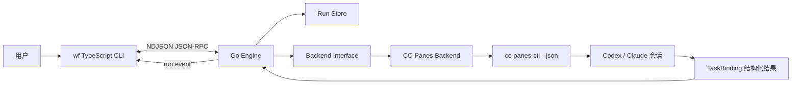
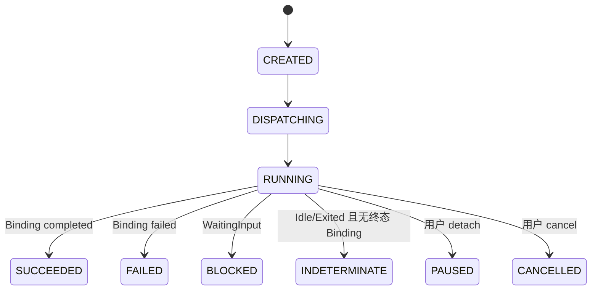

# Workflow Engine (`wf`) — Architecture Plan v0.2

> 状态：已批准，等待 M1 实现  
> 日期：2026-08-04

## 1. 项目目标

当前多 Agent 工作主要依赖 agent-team-workflow、CC-Panes MCP 和对话中的人工调度，存在三个问题：

1. Leader 长时间持有完整上下文，Token 消耗和上下文压力较大。
2. 工作流与 CC-Panes 的交互方式绑定过紧，不利于以后增加其他执行后端。
3. 节点完成后的流转依赖用户或中心 Agent 手动判断，缺少可恢复的引擎状态。

`wf` 的目标是提供一个本地优先的轻量工作流引擎：

- 从自然语言任务或显式模板创建工作流。
- 自动执行节点、收集结构化结果并推进状态。
- 只把节点摘要和必要产物传给后续节点。
- 把 CC-Panes 作为第一个 Backend，而不是产品本身的架构边界。
- 第一版优先服务当前使用者，验证有效后再考虑开源与通用化。

## 2. 已批准的架构基线

| 决策 | 结论 |
|---|---|
| 引擎语言 | Go 1.26+ |
| CLI | TypeScript、Node.js 24+、Ink 5、React 18、clipanion |
| 调度归属 | Go 是唯一调度器和状态真源 |
| TypeScript 职责 | 命令解析、TUI 渲染、JSON-RPC 客户端 |
| 进程模型 | TS CLI 前台启动 Go 子进程 |
| 通信 | stdio 上的 NDJSON JSON-RPC 2.0 |
| 首版 Backend | 通过 `cc-panes-ctl --json` 接入 CC-Panes |
| 完成证据 | TaskBinding 终态是正式证据；终端状态和输出只用于诊断 |
| Token Budget | 第一版只记录软预算，不宣称精确硬限制 |
| 运行数据 | 用户级状态目录，默认不向目标项目写 `.wf/` |
| 工作流创建 | M1 固定单 Agent；M2 显式 DAG 模板；动态 Planner 后置 |
| Skill 语义 | M1 作为 Agent 节点的 `requiredSkills`，不设独立 Skill 节点 |

前期开发采用“当前会话负责计划与验收，独立 Codex Worker 负责写代码”的协作方式，暂不引入 agent-team-workflow。

## 3. 总体架构



### 3.1 Go Engine

Go Engine 独占以下职责：

- Workflow 和 Node 状态机。
- Backend 调度、等待、取消和结果收集。
- 状态持久化与事件轨迹。
- 上下文构建、摘要校验、软预算与后续 fallback。
- JSON-RPC server 和进度通知。

Engine 不依赖 Ink、React 或 CC-Panes UI，也不把 CC-Panes 类型泄漏到核心状态模型。

### 3.2 TypeScript CLI

CLI 只负责：

- 解析 `wf doctor`、`wf run` 等命令。
- 启动和管理 `wf-engine` 子进程。
- 完成协议握手并调用 JSON-RPC。
- 把 `run.event` 渲染为 Ink TUI。
- 非 TTY 环境下降级为逐行纯文本输出。

CLI 不直接调用 CC-Panes，也不保存独立的 workflow 状态。

### 3.3 Backend Interface

```go
type Backend interface {
    Name() string
    Doctor(ctx context.Context) error
    Launch(ctx context.Context, spec LaunchSpec) (*Session, error)
    Wait(ctx context.Context, session Session) (*BackendResult, error)
    Output(ctx context.Context, session Session, lines int) (string, error)
    Cancel(ctx context.Context, session Session) error
}
```

核心层只接触规范化的 `Session` 和 `BackendResult`。CC-Panes 的 launch ID、session ID、TaskBinding ID 等字段放在 Backend 私有 metadata 中。

## 4. M1 垂直链路

M1 只实现一个固定的 `AgentNode`：



执行顺序：

1. CLI 调用 `engine.hello` 完成版本和能力握手。
2. CLI 调用 `run.start`，Engine 创建 run 和单个 Agent 节点。
3. CC-Panes Backend 使用 `cc-panes-ctl --json status` 做健康检查。
4. Backend 创建 TaskBinding，并将 binding ID 写入 Agent prompt。
5. Backend 启动 CC-Panes Agent 会话并回填 session ID。
6. Agent 完成后更新 TaskBinding 的 `status`、`progress`、`completionSummary` 和 metadata。
7. Backend 以 TaskBinding 终态生成规范化 `BackendResult`。
8. Engine 原子写入 snapshot，追加 event，然后向 CLI 发送终态通知。

`Idle` 只表示终端暂时空闲，不等于成功。如果会话已经 Idle/Exited，但 TaskBinding 没有终态，节点必须进入 `INDETERMINATE`，等待人工处理，禁止制造伪成功。

## 5. CC-Panes Backend

M1 不实现 MCP SDK，直接封装 CC-Panes 自带控制面 CLI：

```text
cc-panes-ctl --json status
cc-panes-ctl --json launch ...
cc-panes-ctl --json call create_task_binding --json {...}
cc-panes-ctl --json call update_task_binding --json {...}
cc-panes-ctl --json call wait_for_session --json {...}
cc-panes-ctl --json call query_task_bindings --json {...}
cc-panes-ctl --json sessions read <session-id>
cc-panes-ctl --json sessions kill <session-id>
```

可执行文件发现优先级：

1. `WF_CCPANES_CTL` 环境变量。
2. 当前 `PATH` 中的 `cc-panes-ctl`。
3. Windows 上从正在运行的 `cc-panes.exe` 目录推导 `binaries/cc-panes-ctl.exe`。

发现失败时，`wf doctor` 必须给出设置 `WF_CCPANES_CTL` 的可执行提示。不得把 CC-Panes API token 写入日志或 run 文件。

## 6. 完成协议

Engine 创建 TaskBinding 后，将以下收尾规则注入 Worker prompt：

1. 成功时调用 `update_task_binding`：`status=completed`、`progress=100`、`exitCode=0`。
2. 失败时调用 `update_task_binding`：`status=failed`、非零 `exitCode` 和失败摘要。
3. `completionSummary` 必须是可直接传给后续节点的简短摘要。
4. metadata 可包含 artifacts、warnings、checks 和估算 Token。

规范化结果：

```json
{
  "status": "succeeded",
  "summary": "完成指定任务并通过相关检查",
  "artifacts": ["path/to/file"],
  "warnings": [],
  "checks": ["go test ./..."],
  "usage": {
    "inputTokensEstimated": 0,
    "outputTokensEstimated": 0
  }
}
```

M1 不额外调用 Summarizer Agent。缺少结构化摘要时进入 `INDETERMINATE`；M2 再考虑摘要修复节点。

## 7. JSON-RPC 协议

传输规则：

- JSON-RPC 2.0。
- UTF-8，一行一个完整 JSON 对象。
- Engine stdout 只允许协议消息。
- Engine 日志只能写 stderr。
- CLI 和 Engine 都必须限制单条消息大小。
- 所有 schema 都带 `protocolVersion: 1`。

M1 方法：

```text
engine.hello
run.start
run.get
run.detach
run.cancel
```

M1 通知：

```text
run.event
engine.log
```

`run.start` 返回 run ID，Engine 随后通过 `run.event` 推送状态变化。CLI 收到终态事件后调用 `run.get` 获取最终 snapshot。

## 8. 持久化

默认状态目录：

- Windows：`%LOCALAPPDATA%/wf`
- Linux：`$XDG_STATE_HOME/wf`，缺省 `~/.local/state/wf`
- macOS：`~/Library/Application Support/wf`
- 测试和高级用户可用 `WF_STATE_DIR` 覆盖。

```text
<state-dir>/
└── runs/
    └── <run-id>/
        ├── run.json
        ├── events.jsonl
        └── nodes/
            └── agent-1/
                └── output.log
```

- `run.json` 使用临时文件加 rename 原子替换。
- `events.jsonl` 只追加，不回写历史。
- M1 不使用 SQLite。
- 目标项目内不自动创建 `.wf/`。

## 9. M1 CLI

```text
wf doctor
wf run --project <path> --tool codex "<task>"
```

`wf doctor` 检查：

- Engine 能否启动和完成协议握手。
- `cc-panes-ctl` 是否可发现。
- release orchestrator 和 daemon 是否 ready。
- 指定项目是否已经在 CC-Panes 注册。

`wf run` 默认：

- Backend：`ccpanes`。
- Tool：`codex`。
- Runtime：`local`。
- 当前目录作为 project，除非显式传 `--project`。
- Ctrl+C 第一次执行 detach，保留 Agent 会话；显式 `--cancel` 或后续命令才终止会话。

## 10. 后续里程碑

### M2：显式多节点 DAG

- Workflow YAML/JSON 模板。
- 顺序、条件和人工确认节点。
- `requiredSkills`、`wf status`、`wf resume`。
- 上下文裁剪和摘要校验。

### M3：预算与记忆

- Token 估算、超时、重试和 fallback。
- 项目索引、历史 run 复用。
- SQLite 索引与 Markdown 摘要。

### M4：动态规划和体验打磨

- Planner Agent 动态生成 DAG。
- 完整 Ink TUI。
- Backend 扩展：直接 Codex/Claude CLI、远程执行。
- 在真实项目中逐步替代人工编排。

## 11. M1 验收标准

```powershell
wf doctor
wf run --project E:\some-project --tool codex "输出 hello 并提交结构化摘要"
```

必须满足：

1. Doctor 能给出明确的成功信息或可操作错误。
2. 能启动一个已注册项目中的 Codex 会话。
3. CLI 能显示 Dispatching、Running 和终态。
4. TaskBinding completed 才能得到 Succeeded。
5. WaitingInput、失败和结果缺失不会被误判为成功。
6. run snapshot、事件和输出在 CLI 退出后仍可读取。
7. Go 单元测试、TypeScript 单元测试、构建和基础集成测试通过。

## 12. 明确不做

- Web/桌面 GUI。
- 多租户、RBAC、Agent 市场和插件 SDK。
- 自动 commit、PR、merge 或部署。
- 向量数据库、embedding 和代码知识图谱。
- M1 中的多 Agent、自动重试、精确 Token enforcement。
- M1 中启用 agent-team-workflow。
